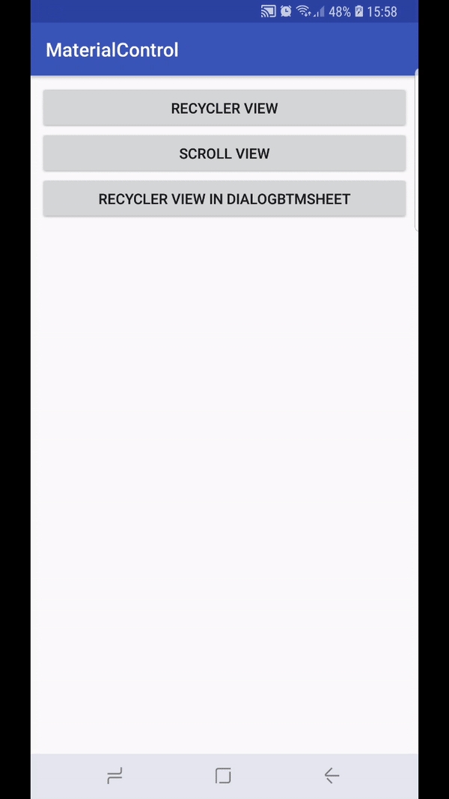

# bottomsheetrecycler
BottomSheet Multiple RecyclerView

#### Last Changes:
 
 - added BottomSheetDialog support
 - fixed click issue in recycle view by @mpetlyuk

#### One of the solutions of multiple RecyclerView/ScrollView in BottomSheetBehavior
#### Usage

[See demo apk](demo_apk/app-debug.apk)



Copy com.matcontrol.control classes to Your project.

Use BottomSheetBehaviorv2 instead BottomSheetBehavior

RecyclerView/Scroll view mast have CoordinatorLayout parent.

For ease to use added BottomSheetBehaviorRecyclerManager class


```
    BottomSheetBehaviorRecyclerManager manager = 
    new BottomSheetBehaviorRecyclerManager(parentCoordinator, behavior, bottomsheetview);
    manager.addControl(recyclerview);
    manager.addControl(recyclerview);
    manager.create();
```

#### If You have OnTouchListener on your Recycler/ScrollView do this:

```
    manager.onTouchScroll(View view, MotionEvent motionEvent); 
```


#### For other details see example application
